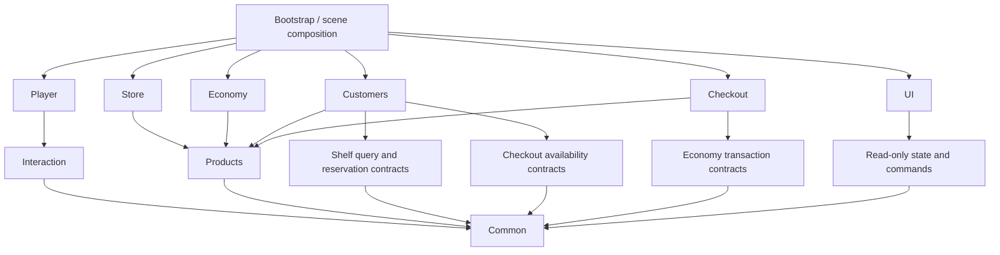

# Clerk Architecture

This document is the architectural baseline for Clerk. It is intentionally
incremental: the current player stocking and furniture placement loops should
remain playable throughout the migration.

## Current snapshot

As of 2026-07-31, the project contains:

- 40 C# scripts and roughly 7,350 lines of C#
- one gameplay scene in the build
- working player movement, interaction, carrying, stocking, pricing, purchasing,
  delivery, and furniture placement foundations
- customer definitions, points, navigation, animation, and visual variation
- no runtime assembly definitions and no automated tests
- no customer shopping lifecycle, checkout loop, or persistence layer yet

The existing design has good reusable building blocks. `InteractableBehaviour`,
`IHeldItem`, stable asset GUID-backed product and purchase IDs, weighted customer
definitions, and the navigation/animation wrappers are all worth keeping.

## The main architectural issue

Several components currently combine four different responsibilities:

1. reading player input
2. applying game rules and changing state
3. manipulating scene objects and physics
4. updating UI or visual presentation

This creates circular dependencies between the current folders. For example,
Core depends on Interaction, Stock, Furniture, and UI, while Stock, Interaction,
and UI also depend back on Core. Folder names therefore do not currently
represent enforceable module boundaries.

The goal is not to replace every MonoBehaviour with an interface. The goal is to
move durable game rules and state out of scene components, then keep
MonoBehaviours as thin Unity adapters.

## Non-negotiable rules

### ScriptableObjects are definitions

Product, customer, box-layout, furniture, and purchase assets are authoring
data. Runtime systems may read them, but must not change them.

`StockInfo.CurrentPrice` currently violates this rule. A shelf price edit writes
to the product asset. Price must instead live in a runtime `ProductState`,
identified by `StockInfo.ProductId`.

### Runtime state has stable IDs

Every saveable entity needs an ID that survives scene reloads:

- products use `ProductId`
- catalog entries use `PurchaseId`
- placed furniture needs a generated instance ID
- shelves and checkouts need persistent instance IDs
- customers usually do not need persistent IDs unless a mid-day save keeps them

Save files contain IDs and plain data, never direct Unity object references.

### Game rules are plain C# when practical

Inventory counts, reservations, baskets, transactions, prices, patience, queue
membership, and progression rules should be testable without a scene.

MonoBehaviours own transforms, colliders, renderers, animation, navigation, and
Unity lifecycle callbacks.

### Dependencies point inward

Customer logic may query a shelf contract. It must not manipulate
`ShelfSpaceController.ObjectsOnShelf`.

Checkout may complete a transaction through an economy contract. It must not
write directly to `WalletController`.

UI observes and sends commands. It must not own authoritative gameplay state.

### One composition root wires the scene

Scene services should be connected by a `GameBootstrap` (or store scene
installer). Avoid adding more global `Instance` properties. Existing singletons
can remain temporarily and be removed one system at a time.

## Target dependency shape



The contracts sit with the consumer or in a small shared domain module. The
scene implementation satisfies them.

## Recommended modules

Do not add all assembly definitions immediately. First remove the current
cycles, then let assembly definitions enforce these boundaries.

### Clerk.Common

Stable IDs, reusable result types, time abstraction where needed, and small
domain primitives. This module should know nothing about player, shelves,
customers, checkout, or UI.

### Clerk.Products

`StockInfo` remains the immutable product definition. Add:

- `ProductState` — runtime price and unlock state for one product
- `ProductStateCatalog` — lookup by `ProductId`
- `ProductPriceChanged` notification
- save DTOs containing product ID and current price

There should be exactly one runtime price per product unless the design
explicitly changes to per-shelf pricing.

### Clerk.Interaction

Keep the interaction selection and priority concept. Replace the concrete
`PlayerInteractionController` reference in `InteractionContext` with a narrow
actor contract, for example:

- `IInteractionActor`
- `ICarryController`
- camera/ray data already carried by the context

Split scanning from input:

- `InteractionScanner` finds and ranks candidates
- `PlayerInteractionInput` maps actions to interaction types
- `PlayerCarryController` owns the held item
- `InteractionPromptPresenter` renders the selected actions

Prompts should use display strings from Input System bindings instead of literal
`[E]` and `[Left Click]` text.

### Clerk.Store

This owns shelves, boxes, physical stock, deliveries, and furniture.

Shelf domain API:

```text
Product
Count
Capacity
AvailableCount
CanAccept(product, quantity)
TryAdd(product, quantity)
TryReserve(customerId, quantity)
ReleaseReservation(reservationId)
TryTakeReserved(reservationId)
```

`ShelfSpaceController` becomes the Unity view/adapter for that inventory. Its
object list represents physical visuals, while a small shelf inventory object
owns count and reservation rules.

Add a `ShelfRegistry` that tracks enabled shelves and exposes read-only queries.
Customers receive the registry through construction/setup; they do not search
the scene.

Suggested split for the current large components:

- `ShelfSpaceController` -> `ShelfInventory`, `ShelfLayout`, `ShelfView`,
  `ShelfInteractable`
- `StockBoxController` -> `StockBoxInventory`, `StockBoxView`,
  `StockBoxHeldItem`, `BoxContentsPreview`
- shared stock/box physics -> `PhysicsHeldItem` helper or base component
- `PlaceableFurniture` -> `FurnitureItem`, `FurniturePlacementView`,
  `FurnitureInteractable`
- `FurniturePlacementController` -> `FurniturePlacementSession` and
  `FurniturePlacementValidator`

Keep these splits practical. A component with one clear job can remain large if
the size comes from validation or Unity configuration code.

### Clerk.Economy

Replace the duplicated stock/furniture purchase paths with a transaction flow:

1. validate request
2. reserve or spend funds
3. fulfill the purchase
4. commit on success or refund on failure
5. publish a transaction record

Use integer minor units (cents) for authoritative money. Floats will eventually
produce rounding errors in totals and statistics.

The economy owns:

- wallet/balance
- purchase transactions
- revenue
- refunds
- operating costs
- daily ledger and profit calculation

Delivery services fulfill purchases; they do not own financial rules.

### Clerk.Customers

Keep `CustomerNavigation` and `CustomerAnimator` as Unity adapters. Build the
lifecycle around:

- `CustomerContext` — references and per-customer runtime data
- `CustomerBrain` — state transitions only
- `CustomerSpawner` — spawn timing, capacity, entrance/exit selection
- `CustomerRegistry` — read-only active customer tracking
- `ShoppingPlan` — desired product IDs and quantities
- `CustomerBasket` — actual reserved/taken items
- `CustomerPatience` — time budget and reactions

Only the brain changes `CustomerState`. State entry starts work; callbacks or
results cause the next transition. Avoid having navigation, animation, and
checkout independently set customer state.

A practical first state sequence is:

```text
Spawning
MovingToEntrance
Shopping
MovingToCheckout
WaitingInCheckoutQueue
CheckingOut
MovingToExit
Despawning
```

Browsing animations and unavailable-product reactions can be layered in after
this sequence works.

Choose one owner for scale variation. Scale ranges currently exist in both
`CustomerDefinition` and `CustomerVisualVariation`; duplicated configuration
will drift.

### Clerk.Checkout

The first checkout implementation needs:

- `CheckoutCounter` and `CheckoutRegistry`
- fixed queue points
- `CheckoutQueue`
- `CheckoutSession`
- basket line items and total calculation
- payment through the economy transaction API
- completion signal consumed by `CustomerBrain`

The queue owns ordering. The customer owns its basket. The counter owns the
active session. The economy owns the money transfer.

### Clerk.Persistence

Persistence begins after the first end-to-end customer checkout works.

Use versioned, plain-data save models:

```text
SaveGame
  version
  player
  economy
  products
  shelves
  furniture
  deliveries
  day
  progression
  statistics
```

Each feature supplies capture/restore data to a central save coordinator. Do not
create one save component that reaches into every scene object.

### Clerk.UI

Split the current `UIController` by screen:

- `PriceEditorPresenter`
- `PurchaseCatalogPresenter`
- `PauseMenuPresenter`
- `HUDPresenter`
- later `CheckoutPresenter` and `DailySummaryPresenter`

A gameplay mode/state service owns whether player movement and interaction are
allowed. Player scripts should not know that a specific price panel or furniture
controller exists.

## Input and gameplay modes

The project already uses Input System actions for movement, look, and jump, but
interaction and furniture scripts read `Keyboard.current` and `Mouse.current`
directly. This prevents complete rebinding and makes gamepad prompts unreliable.

Create dedicated actions for:

- primary interaction
- secondary interaction
- use
- move furniture
- rotate
- cancel
- pause

Use action maps for `Player`, `UI`, and optionally `Placement`. Switching modes
enables the relevant map and controls cursor state in one place.

Suggested modes:

```text
Gameplay
PriceEditing
FurniturePlacement
Paused
CheckoutInteraction
```

This removes the direct checks from `PlayerController` and
`PlayerInteractionController` to `UIController.Instance` and
`FurniturePlacementController.Instance`.

## Migration order

### Phase 0 — protect the working prototype

- add a Play Mode smoke test for player pickup -> shelf -> box restock
- add an Edit Mode test assembly for plain domain code
- record prefab/scene validation steps
- do not rename serialized fields without `FormerlySerializedAs`
- preserve public UnityEvent entry points while their UI is still wired

### Phase 1 — runtime product state and input modes

- move current price out of `StockInfo`
- introduce `ProductStateCatalog`
- make shelf labels and the price editor observe runtime product state
- add the gameplay mode service
- route every gameplay input through Input System actions

This phase removes the highest-risk persistence issue and enables pause and
rebinding without rewriting shelves.

### Phase 2 — customer-safe shelves

- add `ShelfInventory`
- add `ShelfRegistry`
- add reservations and available count
- add customer-facing browse/stand points
- keep player stocking behavior through adapter methods

### Phase 3 — customer entrance-to-exit slice

- add `CustomerContext`, registry, spawner, and brain
- spawn one customer, enter, create a shopping plan, reserve/take one product,
  and move to a checkout placeholder
- handle unavailable stock and movement failure

### Phase 4 — checkout and revenue

- add one counter and fixed queue
- scan/confirm the basket
- complete payment and add a ledger entry
- send the customer to the exit
- prove the full playable loop before adding more UI or content

### Phase 5 — persistence

- save product prices, wallet, shelf inventory, furniture transforms, deliveries,
  and the current day
- add versioning and migration hooks immediately

### Phase 6 — progression and polish

- day loop and daily summary
- licences, unlocks, objectives, and expansions
- employee systems only after the manual restock and checkout loops are stable

## Immediate correctness and maintainability risks

Prioritized from highest impact:

1. Runtime price mutates a `StockInfo` asset.
2. Raw keyboard/mouse reads bypass most of the Input System asset.
3. Player gating depends directly on specific UI and furniture singletons.
4. Shelves expose mutable lists and have no reservation-safe API.
5. `Customer Database.asset` currently contains no customer definitions.
6. Purchase buttons in the sample scene are not connected to purchase commands.
7. Wallet values and prices use floats.
8. Prompt scanning allocates and can run multiple times through `OnGUI`.
9. Box and stock held-item physics behavior is duplicated.
10. There are no assembly boundaries or automated tests.

## Coding conventions for new work

- private serialized fields: `[SerializeField] private`
- public state is read-only unless mutation is an explicit command method
- use one type per file except tiny private/nested helper types
- use `Try...` for expected failure and return a useful result
- events describe completed facts, such as `PriceChanged` or
  `TransactionCompleted`
- unsubscribe from events in the matching Unity lifecycle callback
- never use scene searches in regular gameplay flow
- never mutate definition ScriptableObjects at runtime
- never expose a mutable collection when `IReadOnlyList` is sufficient
- validate required references in `Awake` or a dedicated scene validator
- add a test for each new pure game rule

## Definition of the first playable milestone

The architecture is proving useful when this can happen without special debug
buttons:

1. player orders and stocks a product
2. a customer spawns and enters
3. the customer reserves and takes the product
4. the customer joins a checkout queue
5. the player completes checkout
6. revenue is recorded
7. the customer exits
8. saving and loading restores the store to the same business state

Until this works, prefer completing the vertical slice over adding broad
progression, employees, narrative, or a large catalog.
